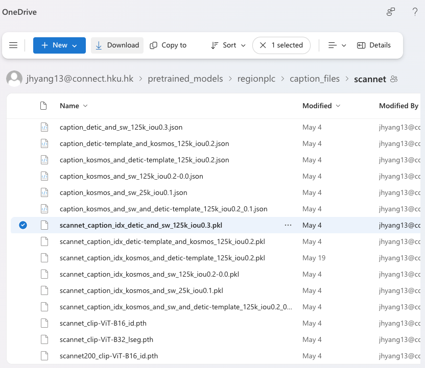
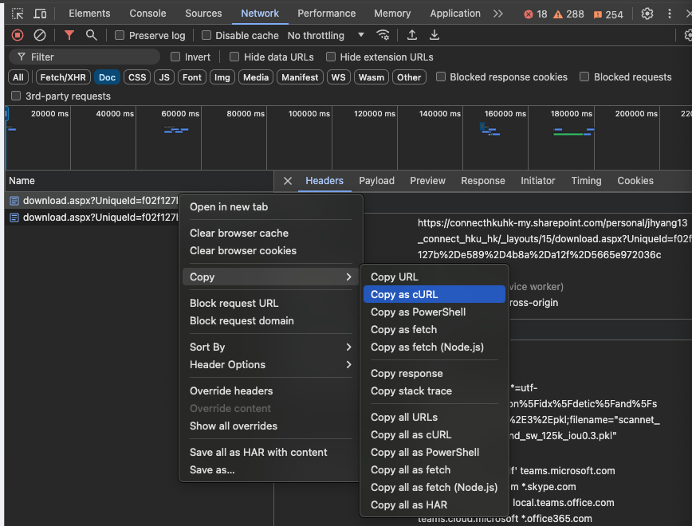

<div align="center">

# Open-vocab 3D Understanding

<a href="https://pytorch.org/get-started/locally/"></a>
<a href="https://pytorchlightning.ai/"></a>
<a href="https://hydra.cc/"></a>
<a href="https://github.com/ashleve/lightning-hydra-template"></a><br>

<!-- [](https://www.nature.com/articles/nature14539)
[](https://papers.nips.cc/paper/2020) -->

</div>

## Description

This is a codebase for various open-vocab 3D understanding models, including open-set indoor semantic segmentations, etc.

## Dataset

Currently, this codebase support training and evaluation on the official dataset provided by [RegionPLC](https://github.com/CVMI-Lab/PLA/tree/regionplc).

To download the dataset, use the following command:

| \*Note that you should update the `FedAuth` token in `src/data/regionplc/download.py` script to recently generated one before downloading.

```bash
python -m src.data.regionplc.download --download_dir [path/to/save/dataset]
# e.g. python -m src.data.region.download --download_dir /home/junhal/datasets/regionplc
```

#### How to obtain fresh `FedAuth` token?

<details><summary>Click</summary>

1. Open the following [link](https://connecthkuhk-my.sharepoint.com/personal/jhyang13_connect_hku_hk/_layouts/15/onedrive.aspx?id=%2Fpersonal%2Fjhyang13%5Fconnect%5Fhku%5Fhk%2FDocuments%2Fpretrained%5Fmodels%2Fregionplc%2Fcaption%5Ffiles%2Fscannet&ga=1) on Google Chrome.

2. Open developer tool and head to the Network tab. Apply `Doc` filter

3. Click a checkbox of some large file, such as `scannet_caption_idx_detic_and_sw_125k_iou0.3.pkl`

4. Click Download button above

<!--  -->


5. Cancel the download process

6. Search for download payload on the Network tab

7. Click right mouse button and click `Copy as cURL`

<!--  -->


08. Paste the copied cURL command somewhere and search for `FedAuth` token.

09. Update `FedAuth` variable in `src/data/regionplc/download.py` to new one.

10. Execute the above download command.

</details>

## Installation

Use of docker is highly recommended.

### Using Warp ConvNet (Not installed by default)

```bash
conda install pytorch==2.2.2 torchvision==0.17.2 pytorch-cuda=12.1 -c pytorch -c nvidia
pip install torch-scatter -f https://data.pyg.org/whl/torch-2.2.0+cu121.html
pip install warp-lang
git clone https://gitlab-master.nvidia.com/3dmmllm/warp
cd warp
# If using conda, install libstdcxx (https://nvidia.github.io/warp/installation.html#conda-environments)
# conda install -c conda-forge libstdcxx-ng=12.1
python build_lib.py
pip install -e .
```

#### On Local Machines

```bash
# build docker image. This command will automatically push the built image to GitLab registry
bash docker/docker_build.sh

# run docker container.
bash docker/docker_run.sh [path/to/datasets]
# e.g. bash docker/docker_run.sh /home/junhal/datasets
```

#### ORD

On ORD cluster, all the installation and docker container-related stuffs are located in sbatch script: `script/train.sbatch`

Update appropriate variables in `script/train.sbatch` script.

## How to run

Train model with default configuration

```bash
# train RegionPLC model with default config (ScanNet-base15 config)
python src/train.py experiment=regionplc logger=wandb
```

If you run the experiments on ORD, use the following command for sbatch job submission

```bash
# scannet base 15
sbatch --gres=gpu:8 ./scripts/train.sbatch \
     experiment=regionplc \
     logger=auto_resume_wandb \
     seed=${SEED} \
     +trainer.precision="16-mixed"

# scannet base 12
sbatch --gres=gpu:8 ./scripts/train.sbatch \
     experiment=regionplc \
     data=regionplc_base12 \
     logger=auto_resume_wandb \
     +trainer.precision="16-mixed"

# scannet base 10
sbatch --gres=gpu:8 ./scripts/train.sbatch \
     experiment=regionplc \
     data=regionplc_base10 \
     logger=auto_resume_wandb \
     +trainer.precision="16-mixed"

# scannet zero-shot
sbatch --gres=gpu:8 ./scripts/train.sbatch \
     experiment=regionplc_openvocab \
     trainer.max_epochs=128 \
     logger=auto_resume_wandb \
     seed=${SEED} \
     +trainer.precision="16-mixed"

# Warp PointConv zero-shot
sbatch --gres=gpu:8 ./scripts/train.sbatch \
     experiment=regionplc_openvocab \
     model=warp_pointconv_enc_dec \
     trainer.max_epochs=128 \
     data.batch_size=2 \
     logger=auto_resume_wandb
```

## Development

Pre-commit is configured to ensure consistent code styling and check for syntax errors.

To install pre-commit hooks and ensure your merge requests pass these checks, run the following command:

```bash
pre-commit install
```

### Using the Latest WarpConvNet

The warpconvnet codebase is updated frequently. To use the latest version, clone the repository inside openvocab-3d repository and make sure the cluster job to use the cloned warpconvnet by installing the warpconvnet via pip directly.

1. Clone the warpconvnet repository inside openvocab-3d repository

```bash
cd openvocab-3d
git clone --recurse-submodules https://gitlab-master.nvidia.com/3dmmllm/warp.git warpconvnet
```

2. When running SLURM jobs, make sure to add `cd warpconvnet; pip install -e .; cd ..;` before running the training script.

```bash
# Your train.sbatch
CMD="
...

cd warpconvnet; pip install -e .; cd ..;

torchrun ...
"
```
